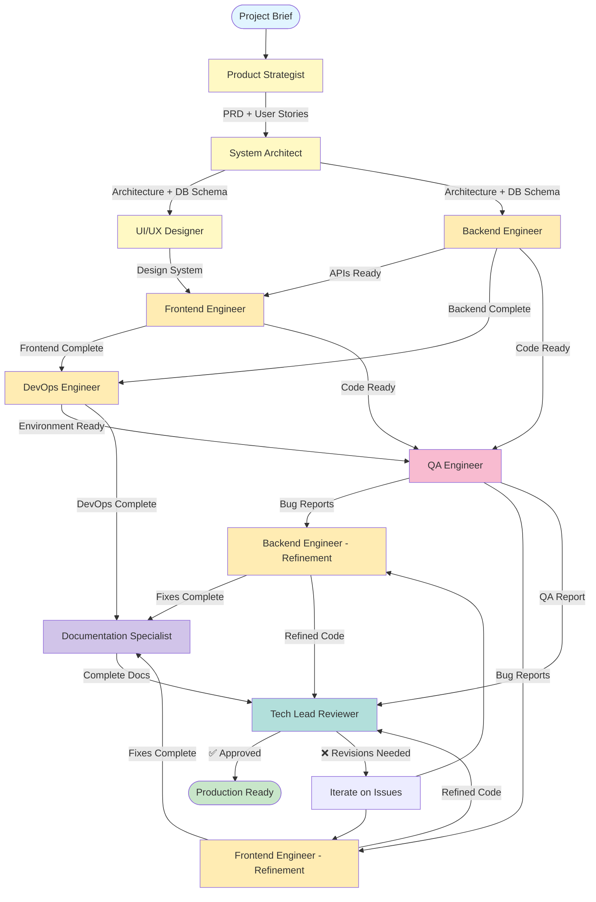

# Elite Software Development Crew - Workflow Diagram

## Complete Agent & Task Flow Visualization



## Detailed Phase Breakdown

### Phase 1: Discovery & Planning 🔍

```
┌─────────────────────────────────────────────────────────────────┐
│                    PHASE 1: DISCOVERY & PLANNING                │
├─────────────────────────────────────────────────────────────────┤
│                                                                 │
│  Input: Project Brief                                          │
│                                                                 │
│  ┌──────────────────────────────────────────────────────┐     │
│  │  Product Strategist (15+ years experience)           │     │
│  │  ─────────────────────────────────────────           │     │
│  │  Tools: Analysis, Markdown Generation                │     │
│  │                                                       │     │
│  │  Tasks:                                              │     │
│  │  • Analyze project brief                            │     │
│  │  • Define user personas                             │     │
│  │  • Create user stories with acceptance criteria     │     │
│  │  • Establish KPIs and success metrics               │     │
│  │  • Prioritize features (MoSCoW)                     │     │
│  │  • Identify risks and mitigation strategies         │     │
│  │                                                       │     │
│  │  Output: PRD.md                                      │     │
│  └──────────────────────────────────────────────────────┘     │
│                           ⬇                                    │
│  ┌──────────────────────────────────────────────────────┐     │
│  │  System Architect (20+ years experience)             │     │
│  │  ────────────────────────────────────────            │     │
│  │  Tools: Analysis, Markdown, PostgreSQL, Filesystem   │     │
│  │                                                       │     │
│  │  Tasks:                                              │     │
│  │  • Design system architecture (clean architecture)   │     │
│  │  • Create database schema (ERD)                      │     │
│  │  • Define API endpoints and contracts                │     │
│  │  • Design auth/authz flows                           │     │
│  │  • Establish folder structure                        │     │
│  │  • Write Architecture Decision Records (ADRs)        │     │
│  │  • Define security measures (OWASP Top 10)           │     │
│  │  • Create error handling strategy                    │     │
│  │                                                       │     │
│  │  Output: ARCHITECTURE.md, Prisma schema draft        │     │
│  └──────────────────────────────────────────────────────┘     │
│                                                                 │
└─────────────────────────────────────────────────────────────────┘
```

### Phase 2: Design 🎨

```
┌─────────────────────────────────────────────────────────────────┐
│                         PHASE 2: DESIGN                         │
├─────────────────────────────────────────────────────────────────┤
│                                                                 │
│  Input: PRD.md + ARCHITECTURE.md                               │
│                                                                 │
│  ┌──────────────────────────────────────────────────────┐     │
│  │  UI/UX Designer (12+ years experience)               │     │
│  │  ──────────────────────────────────────              │     │
│  │  Tools: Analysis, Markdown, Filesystem               │     │
│  │                                                       │     │
│  │  Tasks:                                              │     │
│  │  • Map user flows for all features                  │     │
│  │  • Create wireframes for major screens               │     │
│  │  • Define design tokens (colors, typography, etc)    │     │
│  │  • Specify component library structure               │     │
│  │  • Ensure WCAG 2.1 AA compliance                     │     │
│  │  • Define responsive breakpoints                     │     │
│  │  • Document interaction patterns                     │     │
│  │  • Create component usage guidelines                 │     │
│  │                                                       │     │
│  │  Output: DESIGN_SYSTEM.md                            │     │
│  └──────────────────────────────────────────────────────┘     │
│                                                                 │
└─────────────────────────────────────────────────────────────────┘
```

### Phase 3: Backend Implementation 🔧

```
┌─────────────────────────────────────────────────────────────────┐
│                  PHASE 3: BACKEND IMPLEMENTATION                │
├─────────────────────────────────────────────────────────────────┤
│                                                                 │
│  Input: ARCHITECTURE.md                                        │
│                                                                 │
│  ┌──────────────────────────────────────────────────────┐     │
│  │  Backend Engineer (10+ years experience)             │     │
│  │  ────────────────────────────────────────            │     │
│  │  Tools: Filesystem, Process Executor, PostgreSQL,    │     │
│  │         Jest, Git, Analysis                          │     │
│  │                                                       │     │
│  │  Tasks:                                              │     │
│  │  • Implement Prisma schema                           │     │
│  │  • Create database migrations                        │     │
│  │  • Build API routes with validation (Zod)            │     │
│  │  • Implement NextAuth.js authentication              │     │
│  │  • Create authorization middleware                   │     │
│  │  • Implement business logic                          │     │
│  │  • Add error handling and logging                    │     │
│  │  • Write integration tests                           │     │
│  │  • Optimize queries and add indexes                  │     │
│  │  • Document all API endpoints                        │     │
│  │                                                       │     │
│  │  Output: prisma/, app/api/, lib/auth/, tests/,       │     │
│  │          API_DOCUMENTATION.md                        │     │
│  └──────────────────────────────────────────────────────┘     │
│                                                                 │
└─────────────────────────────────────────────────────────────────┘
```

### Phase 4: Frontend Implementation 💻

```
┌─────────────────────────────────────────────────────────────────┐
│                 PHASE 4: FRONTEND IMPLEMENTATION                │
├─────────────────────────────────────────────────────────────────┤
│                                                                 │
│  Input: DESIGN_SYSTEM.md + API_DOCUMENTATION.md                │
│                                                                 │
│  ┌──────────────────────────────────────────────────────┐     │
│  │  Frontend Engineer (10+ years experience)            │     │
│  │  ─────────────────────────────────────────           │     │
│  │  Tools: Filesystem, Process Executor, Jest,          │     │
│  │         Playwright, Git, Analysis                    │     │
│  │                                                       │     │
│  │  Tasks:                                              │     │
│  │  • Set up Next.js project structure                  │     │
│  │  • Implement pages using App Router                  │     │
│  │  • Build reusable components (design system)         │     │
│  │  • Implement server/client component split           │     │
│  │  • Create custom hooks                               │     │
│  │  • Integrate with backend APIs                       │     │
│  │  • Implement forms with validation                   │     │
│  │  • Add loading states & error boundaries             │     │
│  │  • Ensure accessibility (ARIA, keyboard nav)         │     │
│  │  • Implement responsive design                       │     │
│  │  • Optimize performance (code splitting, etc)        │     │
│  │  • Write component tests                             │     │
│  │                                                       │     │
│  │  Output: app/, components/, hooks/, lib/, tests/,    │     │
│  │          COMPONENTS.md                               │     │
│  └──────────────────────────────────────────────────────┘     │
│                                                                 │
└─────────────────────────────────────────────────────────────────┘
```

### Phase 5: DevOps & Automation ⚙️

```
┌─────────────────────────────────────────────────────────────────┐
│               PHASE 5: DEVOPS & AUTOMATION                      │
├─────────────────────────────────────────────────────────────────┤
│                                                                 │
│  Input: Complete codebase (frontend + backend)                 │
│                                                                 │
│  ┌──────────────────────────────────────────────────────┐     │
│  │  DevOps Engineer (8+ years experience)               │     │
│  │  ──────────────────────────────────────              │     │
│  │  Tools: Filesystem, Process Executor, Docker,        │     │
│  │         Git, Analysis                                │     │
│  │                                                       │     │
│  │  Tasks:                                              │     │
│  │  • Create Docker Compose setup                       │     │
│  │  • Set up environment variable management            │     │
│  │  • Configure package.json scripts                    │     │
│  │  • Set up ESLint and Prettier                        │     │
│  │  • Configure pre-commit hooks (Husky)                │     │
│  │  • Create database seed scripts                      │     │
│  │  • Set up CI/CD pipeline (GitHub Actions)            │     │
│  │  • Configure test automation                         │     │
│  │  • Create onboarding scripts                         │     │
│  │                                                       │     │
│  │  Output: docker-compose.yml, .github/workflows/,     │     │
│  │          configs, scripts/, SETUP.md                 │     │
│  └──────────────────────────────────────────────────────┘     │
│                                                                 │
└─────────────────────────────────────────────────────────────────┘
```

### Phase 6: Quality Assurance ✅

```
┌─────────────────────────────────────────────────────────────────┐
│                   PHASE 6: QUALITY ASSURANCE                    │
├─────────────────────────────────────────────────────────────────┤
│                                                                 │
│  Input: Complete application + environment                     │
│                                                                 │
│  ┌──────────────────────────────────────────────────────┐     │
│  │  QA Engineer (12+ years experience)                  │     │
│  │  ───────────────────────────────────                 │     │
│  │  Tools: Jest, Playwright, Process Executor,          │     │
│  │         Analysis, Markdown                           │     │
│  │                                                       │     │
│  │  Tasks:                                              │     │
│  │  • Review and enhance existing tests                 │     │
│  │  • Create E2E test suite (Playwright)                │     │
│  │  • Test all user flows                               │     │
│  │  • Perform accessibility audit (WCAG 2.1 AA)         │     │
│  │  • Run Lighthouse performance audits                 │     │
│  │  • Test error handling and edge cases                │     │
│  │  • Validate security (OWASP Top 10 checklist)        │     │
│  │  • Test responsive design                            │     │
│  │  • Generate test coverage reports                    │     │
│  │  • Create bug reports with reproduction steps        │     │
│  │  • Validate PRD acceptance criteria                  │     │
│  │                                                       │     │
│  │  Quality Gates:                                      │     │
│  │  ✓ Test coverage >80%                               │     │
│  │  ✓ Accessibility score >95                          │     │
│  │  ✓ Performance score >90                            │     │
│  │  ✓ Zero critical security issues                    │     │
│  │                                                       │     │
│  │  Output: tests/e2e/, QA_REPORT.md                    │     │
│  └──────────────────────────────────────────────────────┘     │
│                                                                 │
└─────────────────────────────────────────────────────────────────┘
```

### Phase 7: Bug Fixes & Refinement 🔨

```
┌─────────────────────────────────────────────────────────────────┐
│               PHASE 7: BUG FIXES & REFINEMENT                   │
├─────────────────────────────────────────────────────────────────┤
│                                                                 │
│  Input: QA_REPORT.md with bugs and recommendations             │
│                                                                 │
│  ┌──────────────────────────────────────────────────────┐     │
│  │  Backend Engineer - Refinement                       │     │
│  │  ──────────────────────────                          │     │
│  │  • Fix security vulnerabilities (highest priority)   │     │
│  │  • Optimize slow database queries                    │     │
│  │  • Improve error handling                            │     │
│  │  • Address API inconsistencies                       │     │
│  │  • Update integration tests                          │     │
│  │  • Refactor code smells                              │     │
│  │                                                       │     │
│  │  Output: Refined backend + BACKEND_REFINEMENT.md     │     │
│  └──────────────────────────────────────────────────────┘     │
│                           ⬇                                    │
│  ┌──────────────────────────────────────────────────────┐     │
│  │  Frontend Engineer - Refinement                      │     │
│  │  ───────────────────────────                         │     │
│  │  • Fix accessibility issues (highest priority)       │     │
│  │  • Implement performance optimizations               │     │
│  │  • Improve error boundaries & loading states         │     │
│  │  • Refine responsive design issues                   │     │
│  │  • Enhance user feedback mechanisms                  │     │
│  │  • Update component tests                            │     │
│  │                                                       │     │
│  │  Output: Refined frontend + FRONTEND_REFINEMENT.md   │     │
│  └──────────────────────────────────────────────────────┘     │
│                                                                 │
└─────────────────────────────────────────────────────────────────┘
```

### Phase 8: Documentation 📚

```
┌─────────────────────────────────────────────────────────────────┐
│                     PHASE 8: DOCUMENTATION                      │
├─────────────────────────────────────────────────────────────────┤
│                                                                 │
│  Input: All previous work (code, tests, configs, reports)      │
│                                                                 │
│  ┌──────────────────────────────────────────────────────┐     │
│  │  Documentation Specialist (10+ years experience)     │     │
│  │  ────────────────────────────────────────────        │     │
│  │  Tools: Markdown Generation, Filesystem, Analysis    │     │
│  │                                                       │     │
│  │  Tasks:                                              │     │
│  │  • Create comprehensive README                       │     │
│  │  • Document development setup (SETUP.md)             │     │
│  │  • Create API documentation with examples            │     │
│  │  • Document components with usage examples           │     │
│  │  • Write architecture documentation                  │     │
│  │  • Create deployment guide                           │     │
│  │  • Write troubleshooting guide                       │     │
│  │  • Create CONTRIBUTING.md                            │     │
│  │  • Maintain CHANGELOG.md                             │     │
│  │  • Add inline code comments                          │     │
│  │  • Create operations runbook                         │     │
│  │                                                       │     │
│  │  Output: Complete docs/ directory with:              │     │
│  │  • README.md          • DEPLOYMENT.md                │     │
│  │  • SETUP.md           • TROUBLESHOOTING.md           │     │
│  │  • ARCHITECTURE.md    • CONTRIBUTING.md              │     │
│  │  • API.md             • CHANGELOG.md                 │     │
│  │  • COMPONENTS.md      • RUNBOOK.md                   │     │
│  └──────────────────────────────────────────────────────┘     │
│                                                                 │
└─────────────────────────────────────────────────────────────────┘
```

### Phase 9: Final Review & Sign-off 🎯

```
┌─────────────────────────────────────────────────────────────────┐
│              PHASE 9: FINAL REVIEW & SIGN-OFF                   │
├─────────────────────────────────────────────────────────────────┤
│                                                                 │
│  Input: All project deliverables                               │
│                                                                 │
│  ┌──────────────────────────────────────────────────────┐     │
│  │  Technical Lead & Reviewer (20+ years experience)    │     │
│  │  ─────────────────────────────────────────────       │     │
│  │  Tools: Analysis, Process Executor, Git, Markdown    │     │
│  │                                                       │     │
│  │  Review Checklist:                                   │     │
│  │  ✓ Code Quality                                     │     │
│  │    - Clean code, SOLID principles                   │     │
│  │    - DRY, proper abstractions                       │     │
│  │    - No code smells                                 │     │
│  │                                                       │     │
│  │  ✓ Architecture Compliance                          │     │
│  │    - Follows approved architecture                  │     │
│  │    - Proper separation of concerns                  │     │
│  │    - ADR compliance                                 │     │
│  │                                                       │     │
│  │  ✓ Security                                         │     │
│  │    - OWASP Top 10 compliance                        │     │
│  │    - No vulnerabilities                             │     │
│  │    - Proper auth/authz                              │     │
│  │                                                       │     │
│  │  ✓ Performance                                      │     │
│  │    - Optimized queries                              │     │
│  │    - Fast load times                                │     │
│  │    - Lighthouse score >90                           │     │
│  │                                                       │     │
│  │  ✓ Testing                                          │     │
│  │    - Coverage >80%                                  │     │
│  │    - Quality tests                                  │     │
│  │    - All scenarios covered                          │     │
│  │                                                       │     │
│  │  ✓ Accessibility                                    │     │
│  │    - WCAG 2.1 AA compliance                         │     │
│  │    - Lighthouse score >95                           │     │
│  │                                                       │     │
│  │  ✓ Documentation                                    │     │
│  │    - Complete and accurate                          │     │
│  │    - Practical examples                             │     │
│  │    - Up-to-date                                     │     │
│  │                                                       │     │
│  │  ✓ Production Readiness                             │     │
│  │    - Error handling                                 │     │
│  │    - Logging                                        │     │
│  │    - Monitoring hooks                               │     │
│  │                                                       │     │
│  │  Output: FINAL_REVIEW.md with:                      │     │
│  │  • Code review summary                              │     │
│  │  • Architecture compliance assessment               │     │
│  │  • Security audit results                           │     │
│  │  • Performance evaluation                           │     │
│  │  • Test coverage analysis                           │     │
│  │  • Documentation review                             │     │
│  │  • Technical debt assessment                        │     │
│  │  • Production readiness checklist                   │     │
│  │  • ✅ APPROVAL or ❌ REVISION REQUESTS              │     │
│  └──────────────────────────────────────────────────────┘     │
│                                                                 │
└─────────────────────────────────────────────────────────────────┘
```

## Data Flow Diagram

```
┌───────────────┐
│ Project Brief │
└───────┬───────┘
        │
        ▼
┌───────────────────┐
│  Product          │──────────┐
│  Requirements     │          │
│  (PRD)            │          │
└───────┬───────────┘          │
        │                      │
        ▼                      │
┌───────────────────┐          │
│  System           │          │
│  Architecture     │◄─────────┘
│  + DB Schema      │
└───────┬───────────┘
        │
        ├─────────────┬────────────────┐
        │             │                │
        ▼             ▼                ▼
┌───────────┐  ┌──────────┐    ┌──────────┐
│  Design   │  │ Backend  │    │          │
│  System   │  │   Code   │    │          │
└─────┬─────┘  └────┬─────┘    │          │
      │             │           │          │
      │             ▼           │          │
      │      ┌──────────┐       │          │
      │      │   APIs   │       │          │
      │      └────┬─────┘       │          │
      │           │             │          │
      └───────────┴─────────────┤          │
                  │             │          │
                  ▼             │          │
            ┌──────────┐        │          │
            │ Frontend │        │          │
            │   Code   │        │          │
            └────┬─────┘        │          │
                 │              │          │
                 ├──────────────┘          │
                 │                         │
                 ▼                         │
          ┌──────────────┐                │
          │   DevOps     │                │
          │ Environment  │                │
          └──────┬───────┘                │
                 │                         │
                 ▼                         │
          ┌──────────────┐                │
          │  QA Testing  │                │
          │  & Reports   │                │
          └──────┬───────┘                │
                 │                         │
                 ├─────────┬───────────────┘
                 │         │
                 ▼         ▼
        ┌──────────┐  ┌──────────┐
        │ Backend  │  │ Frontend │
        │  Fixes   │  │  Fixes   │
        └────┬─────┘  └────┬─────┘
             │             │
             └──────┬──────┘
                    │
                    ▼
            ┌──────────────┐
            │Documentation │
            └──────┬───────┘
                   │
                   ▼
            ┌──────────────┐
            │Final Review  │
            │  & Sign-off  │
            └──────┬───────┘
                   │
                   ▼
            ┌──────────────┐
            │ Production   │
            │    Ready!    │
            └──────────────┘
```

## Tool Usage Matrix

| Agent | Filesystem | Process | Database | Docker | Git | Tests | Docs | Analysis |
|-------|-----------|---------|----------|--------|-----|-------|------|----------|
| Product Strategist | | | | | | | ✓ | ✓ |
| System Architect | ✓ | | ✓ | | | | ✓ | ✓ |
| UI/UX Designer | ✓ | | | | | | ✓ | ✓ |
| Backend Engineer | ✓ | ✓ | ✓ | | ✓ | ✓ | | ✓ |
| Frontend Engineer | ✓ | ✓ | | | ✓ | ✓ | | ✓ |
| DevOps Engineer | ✓ | ✓ | | ✓ | ✓ | | | ✓ |
| QA Engineer | | ✓ | | | | ✓ | ✓ | ✓ |
| Documentation Specialist | ✓ | | | | | | ✓ | ✓ |
| Tech Lead Reviewer | | ✓ | | | ✓ | | ✓ | ✓ |

## Quality Gates Flow

```
┌─────────────────────────────────────────────────────────────┐
│                     QUALITY GATES                           │
├─────────────────────────────────────────────────────────────┤
│                                                             │
│  Gate 1: Security Check                                    │
│  ├─ No critical vulnerabilities        [REQUIRED]          │
│  └─ OWASP Top 10 compliance            [REQUIRED]          │
│                                                             │
│  Gate 2: Test Coverage                                     │
│  ├─ Unit tests >80%                    [REQUIRED]          │
│  ├─ Integration tests complete         [REQUIRED]          │
│  └─ E2E tests for critical flows       [REQUIRED]          │
│                                                             │
│  Gate 3: Accessibility                                     │
│  ├─ WCAG 2.1 AA compliance            [REQUIRED]          │
│  ├─ Lighthouse score >95              [REQUIRED]          │
│  └─ Keyboard navigation works         [REQUIRED]          │
│                                                             │
│  Gate 4: Performance                                       │
│  ├─ Lighthouse score >90              [REQUIRED]          │
│  ├─ Page load <2 seconds             [REQUIRED]          │
│  └─ Optimized queries                 [REQUIRED]          │
│                                                             │
│  Gate 5: Documentation                                     │
│  ├─ All docs complete                 [REQUIRED]          │
│  ├─ Setup works in <30 min            [REQUIRED]          │
│  └─ API docs have examples            [REQUIRED]          │
│                                                             │
│  All gates PASS? ──────────────────> ✅ Production Ready   │
│  Any gate FAIL? ──────────────────> ❌ Request Revisions  │
│                                                             │
└─────────────────────────────────────────────────────────────┘
```

## Time & Cost Estimation

```
┌────────────────────────────────────────────────────────────────┐
│                  EXECUTION TIME ESTIMATES                      │
├────────────────────────────────────────────────────────────────┤
│                                                                │
│  Small Project (< 5 features)                                 │
│  ├─ Time: 15-30 minutes                                       │
│  ├─ Cost (GPT-4): $5-15                                       │
│  └─ Cost (GPT-3.5): $0.50-1.50                               │
│                                                                │
│  Medium Project (5-15 features)                               │
│  ├─ Time: 30-60 minutes                                       │
│  ├─ Cost (GPT-4): $15-40                                      │
│  └─ Cost (GPT-3.5): $1.50-4.00                               │
│                                                                │
│  Large Project (15+ features)                                 │
│  ├─ Time: 1-3 hours                                           │
│  ├─ Cost (GPT-4): $40-100+                                    │
│  └─ Cost (GPT-3.5): $4.00-10.00                              │
│                                                                │
└────────────────────────────────────────────────────────────────┘
```

---

**This workflow ensures production-ready code through systematic development, comprehensive testing, and thorough quality review!** 🚀
